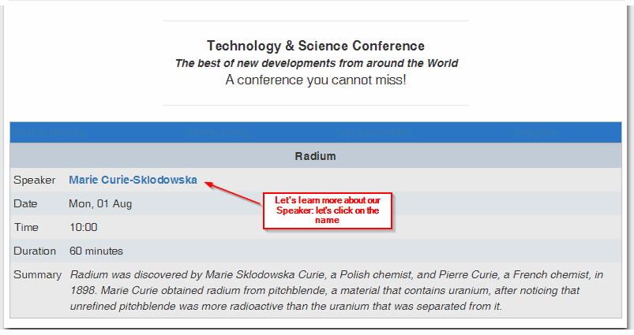
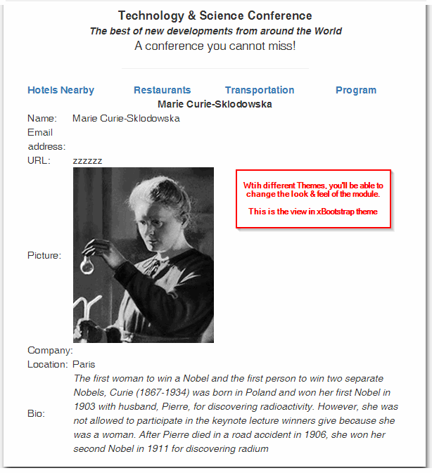
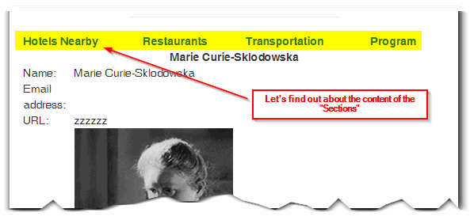

# 5.0 The User Side

After you entered all the information, the module creates automatically a "Program Schedule Grid", with individual sessions and tracks.

You can learn more about individual sessions by clicking on them,  and you can also learn more about the presenter by clicking on his/her name inside the info about the session

Of course, you can modify the "Look & Feel" of the module by using a different Theme, or developing your own one.

This is how the Presenter Bio looks in our "xBootstrap" theme

As you hopefully remember, the module also provides unlimited number of "Sections", which are specificaly for congress information data. Things like "Hotels close to the event", "Location", "Who's giving this event", "Sponsors", anything directly related with the event. These sections will show as a header for almost every page. 

Inside each "Section" you can place all the information that you think would be useful to the participants. 

