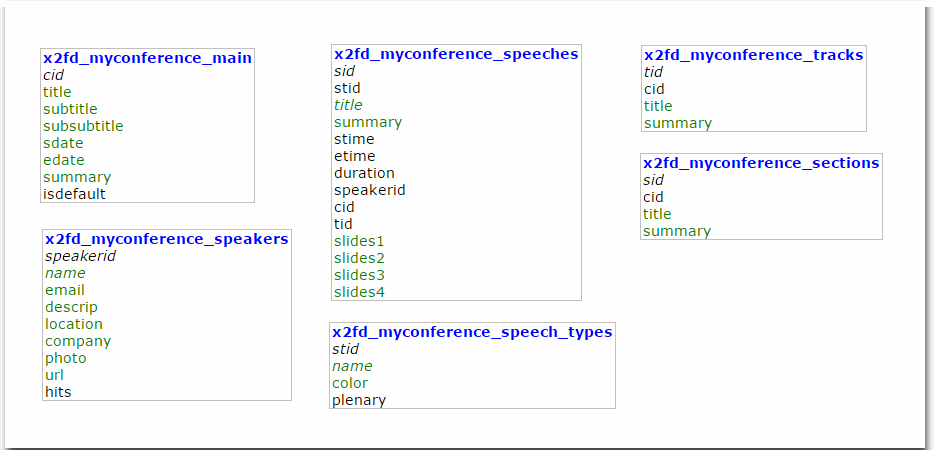

# Other

### Events \(date / day\)

* Sending of talks info to visitors of the site?
* Sponsors / Organizer?
  * Ask if they are ordered in alphabetical order
  * Categories of sponsors \(tick if put in the footer\)

### Blocks:

* Tracks
* Program

### Features:

* Registration
  * "fast" print of the entry form
  * external registration
  * Form creation by users \(FormBuilder?\)
  * Registration -Statistics
* Automatic creation of the program grid
* Detection of inconcistencies, overlaps
* Press Room?
* Comments from people on the talks?
* Notification of changes?
* PDF with the program \(sponsors and organizer\)

## Database

### Tables:

* conference\_congress 
* conference\_speakers 
* conference\_speech\_type 
* conference\_speech 
* conference\_tracks 
* conference\_sponsors 
* conference\_speech\_eval

### Fields in Tables:

* conference\_congress 
  * conid 
  * sdate 
  * edate 
  * title 
  * subtitle 
  * subsubtitle 
  * logo
* conference\_speakers 
  * speakerid 
  * name 
  * email 
  * descrip 
  * photo 
  * url

